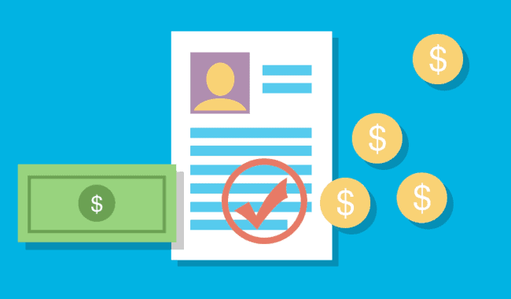

# Credit Risk Analysis

## Overview

### Purpose

The purpose of this analysis is to apply machine learning to solve a real-world challenge: credit card risk. Credit risk is an inherently unbalanced classification problem, as good loans easily outnumber risky loans. Therefore, different techniques are employed to train and evaluate models with unbalanced classes. Libraries such as imbalanced-learn and scikit-learn are used to build and evaluate models using resampling.

Using the credit card credit dataset from LendingClub, a peer-to-peer lending services company, the data is oversampled using the RandomOverSampler and SMOTE algorithms, and the data is undersampled using the ClusterCentroids algorithm. Furthermore, a combinatorial approach of over- and undersampling using the SMOTEENN algorithm is used as well. Next, two new machine learning models that reduce bias, BalancedRandomForestClassifier and EasyEnsembleClassifier, are compared to predict credit risk. Finally, the performance of these models are evaluated to recommend on whether they should be used to predict credit risk.

  
  

&nbsp;

## Results

### Dataset and Files

The analysis is based on the following: 

* Credit card credit dataset from LendingClub: [LoanStats_2019Q1](LoanStats_2019Q1.csv.zip)
* Resampling Models and the SMOTEENN algorithm to Predict Credit Risk: [credit_risk_resampling](credit_risk_resampling.ipynb)
* Ensemble Classifiers to Predict Credit Risk: [credit_risk_ensemble](credit_risk_ensemble.ipynb)

### Software and Application

* Python 3.7.9 
* Jupyter Notebooks 6.1.4

### Outcomes 

Six machine learning models were used to evaluate the credit card credit dataset from LendingClub to determine which is better at predicting credit risk. These six machine learning models are the following:

* Oversampling  - RandomOverSampler
* Oversampling  - SMOTE
* Undersampling - ClusterCentroids
* Combinatorial - SMOTEENN
* Ensemble Classifiers - BalancedRandomForestClassifier
* Ensemble Classifiers - EasyEnsembleClassifier

Below is a brief summary of the performance of all six machine learning models.

* **Oversampling  - RandomOverSampler**

&nbsp;

* **Oversampling  - SMOTE (Synthetic Minority Oversampling Technique)**

&nbsp;

* **Undersampling - ClusterCentroids**

&nbsp;

* **Combinatorial - SMOTEENN (SMOTE and Edited Nearest Neighbors (ENN))**

&nbsp;

* **Ensemble Classifiers - BalancedRandomForestClassifier**

&nbsp;

* **Ensemble Classifiers - EasyEnsembleClassifier**

&nbsp;

## Summary

As mentioned in the results, 35.39% of Vine reviews were 5-stars. Even though these reviews are written by members of the paid Amazon Vine program, it is not led to believe that there is a positivity bias for reviews of the beauty products in the Vine program. This is mainly due to the conservative percentage of the 5-star reviews found in this analysis and most likely because it’s an invitation-only program. Which means, a selective group of people are encouraged to submit their reviews for beauty products at Amazon.

With that stated, an additional analysis using the data from the *verified purchase* column could be used to analyze the quality of product reviews. The data can be filtered to consider reviews from members of the paid Amazon Vine program as well as from non-paid individuals, that have more than 20 total votes and that a purchase has been verified. It is found that an "Amazon Verified Purchase" review means Amazon has verified that the person writing the review purchased the product at Amazon and didn't receive the product at a deep discount. As a result, this can further confirm the reviews for beauty products are unbiased. 

In conclusion, a data exploration on Amazon's Beauty products dataset was done to filter product reviews that were written by members of the paid Amazon Vine program as well as from non-paid individuals. PySpark was used to perform the ETL process. That is, to extract the dataset, transform the data, connect to an AWS RDS instance, and load the transformed data into pgAdmin. Additionally, PySpark was used to determine if there was any bias toward favorable reviews from Vine members in the dataset. 

&nbsp;

  

